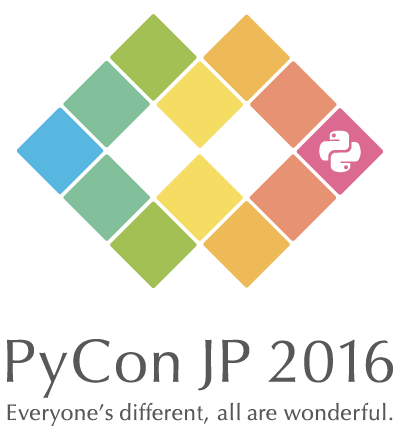

# PyCon JP Official Guile App [](https://raw.githubusercontent.com/pyconjp/pyconjp-ios/develop/LICENSE) 

* Swift 3.x
* Xcode8.x
* iOS 9.0~

## SwiftLint推奨
https://github.com/realm/SwiftLint

```sh
$brew install swiftlint
```

## ライブラリはCarthageで管理しています   
https://github.com/Carthage/Carthage

```sh
$brew install carthage
$carthage update --platform iOS
```

### 以下のライブラリを使用しています
* [Alamofire](https://github.com/Alamofire/Alamofire)
* [AlamofireImage](https://github.com/Alamofire/AlamofireImage)
* [RealmSwift](https://realm.io/docs/swift/latest/)

## ステージングAPIのURL、basic認証
**ステージングの認証情報はスタッフ内シークレットです**  
APIのURL、basic認証のユーザー名、パスワードはSchemeの環境変数を参照しています  
ステージングへの接続は、以下の設定をしてください (本番環境へは、設定せずに接続できます)  

1. `New Scheme` から新しいSchemeを作成 (非共有設定、git管理にしない)
2. `Edit Scheme` > `Run` > `Arguments` > `Enviroment Variables` に以下の項目を追加  
    * APIBaseURL
    * APIAuthUser
    * APIAuthPassword

## License
[pyconjp-ios](https://github.com/pyconjp/pyconjp-ios) is released under the [MIT License](LICENSE.md).


